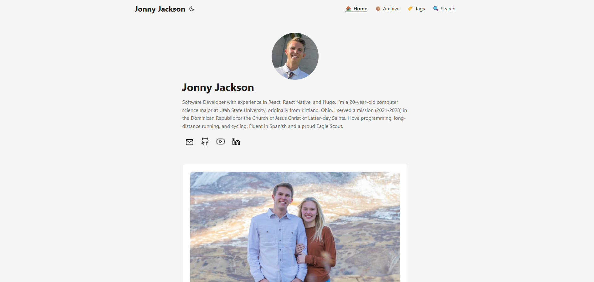

# Jonny-Jackson.com

My Portfolio Website, hosted on Netlify. Uses DecapCMS. I chose to use HUGO for my portfolio site for it's simplicity, incredible speed, good SEO, and easy maintenance. I used the [PaperMod Theme](https://github.com/adityatelange/hugo-PaperMod).

Make sure you `git pull` because any posts you add from the admin dashboard wont be here locally
`hugo server - start`
